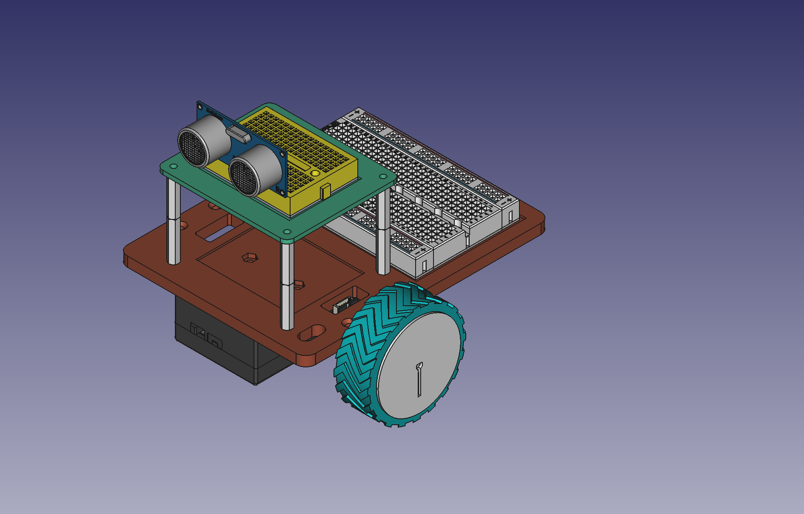

# R1Bot's Mechanical Design

## Preview

## Assembly Parts List
| Name | Description | Quantity |
| :--- | :--- | ---: |
| [Base plate](/prints/STL/Base.stl) | holds all components | 1 |
| [Motor Bracket](/prints/STL/MotorBracket.stl) | holds motor on base | 2 |
| [Caster Wheel](/prints/STL/CasterWheel.stl) | offers omni-directional rotate | 1 |
| M2.5x14 flathead screw | secures caster wheel on base  | 4 |
| [Tire](/prints/STL/Tire.stl) | provides traction | 2 |
| [Wheel](/prints/STL/Wheel.stl) | attaches to motor and supports tire | 2 |
| [N20 geared DC motor with encoder](https://www.robotshop.com/products/e-s-motor-6v-1001-micro-metal-gearmotor-w-encoder-cable-150rpm?qd=90463b9daaf95d60f529422572c0d37f) | spins and senses wheel | 2 |
| 6-Pin JST-ZH connector with wires | connects motor to motor control PCB  | 2 |
| M2.5x8 flathead screw | secures motor bracket on base  | 4 |
| Battery holder | hosts 2 Li-ion batteries  | 1 |
| 18650 Lithium-ion Battery | provides DC power | 2 |
| M2.5x5 flathead screw | secures battery holder on base  | 4 |
| M2.5 nut | pairs with the screws  | 16 |
| Power expansion board (PEB) | regulates 6~24 V to 5 V  | 1 |
| M2.5x10 standoff | supports PEB | 4 |
| Motor control board (MCB) | bridges Pico, Pololu713, HC-SR04, motors and encoders  | 1 |
| M2.5x15 standoff | supports MCB | 4 |
| M2.5x6 screw | caps MCB | 4 |
